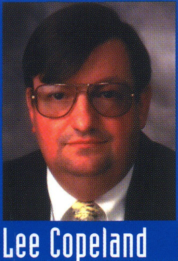

# A Practitioner's Guide to Software Test Design

**Lee Copeland**

Artech House出版

Boston • London

Library of Congress and British CIP information available on request 685 Canton Street Norwood, MA 02062
(781) 769-9750
[www.artechhouse.com](http://www.artechhouse.com)

46 Gillingham Street
London SW1V 1AH
+44 (0)20 7596-8750

Copyright © 2004 STQE Publishing

All rights reserved. No part of this book shall be reproduced, stored in a retrieval system, or transmitted by any means, electronic, mechanical, photocopying, recording, or otherwise without written permission from the publisher.
International Standard Book Number: 1-58053-791-X
Printed in the United States of America
First Printing: November 2003

**商标**

All terms mentioned in this book that are known to be trademarks or service marks have been appropriately capitalized. Artech House Publishers and STQE Publishing cannot attest to the accuracy of this information. Use of a term in this book should not be regarded as affecting the validity of any trademark or service mark.

**警告和免责声明**

Every effort has been made to make this book as complete and accurate as possible, but no warranty or fitness is implied. The information provided is on an "as is" basis. The authors and the publisher shall have neither liability nor responsibility to any person or entity with respect to any loss or damages arising from the information contained in this book.

**鸣谢**

给我的妻子 Suzanne，还有我们的好孩子和孙子孙女们

&nbsp;&nbsp; Shawn and Martha

&nbsp;&nbsp;&nbsp;&nbsp;&nbsp;&nbsp; Andrew and Cassandra

&nbsp;&nbsp;   David

&nbsp;&nbsp; Cathleen

&nbsp;&nbsp;&nbsp;&nbsp;&nbsp;&nbsp; Katelynn and Kiley

&nbsp;&nbsp; Melissa and Jay

&nbsp;&nbsp;&nbsp;&nbsp;&nbsp;&nbsp; Ross, Elizabeth, and Miranda

&nbsp;&nbsp; Brian and Heather

&nbsp;&nbsp;&nbsp;&nbsp;&nbsp;&nbsp; Cassidy and Caden

&nbsp;&nbsp; Thomas and Jeni

&nbsp;&nbsp; Carrie

&nbsp;&nbsp; Sundari

&nbsp;&nbsp; Rajan

同时感谢 Wayne, Jerry, Dani, Ron, and Rayanne  

感谢他们这么多年的鼓励和支持

Lee Copeland是软件测试国际知名咨询师，有着30年信息系统专业经验。他有包括商业和非盈利组织中软件开发，测试，过程提升等领域的多个技术和管理职位，同时他在美国和国际范围内教授研讨会并提供广泛的咨询。

作为软件质量工程领域的咨询师，Lee 奔波世界各地为帮助客户提升软件测试有效性，另外，他是软件测试的全球第一峰会 STAREAST 和 STARWEST 的执行主席。