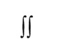

# 前言
*A Practitioner's Guide to Software Test Design* 是唯一一本包含了当今测试设计方法的书，以往软件测试人员需要通过搜索大量书籍、期刊、网络来获取这些关键信息。

**测试设计的价值:**

个人认为，完整的、仔细的、系统的测试活动，对于发现大量缺陷的测试设计以及相应的测试活动是很有效的。

----Boris Beizer

本书聚焦于软件测试设计，没有测试设计、测试管理、测试团队建设等的话题，虽然他们在软件测试中很重要，它们往往忽略测试人员真正需要的---更多的测试方面的实践，特别是测试用例设计。其他优秀书籍介绍了软件测试的全过程。其中我最爱的一本是 Rick Craig 和 Stefan Jaskiel 写的 *Systematic Software Testing*。

*A Practitioner's Guide to Software Test Design* 通过详细示例和一步步的演示阐述测试设计方法，指引读者清晰理解测试设计技术。

### 当今测试面临的挑战

对于一定规模的系统，测试所有不同逻辑和输入数据的所有组合是不可能的，测试面临无穷集合的选择，每个逻辑和输入都是有必要测试的，但是测试人员只能选取很小的一个子集进行测试因为有资源限制。本书目的是帮助你分析，设计，选择子集，实现最小子集测试达到最大覆盖，发现最多缺陷。

明智地选择测试用例是至关重要的，如果一个系统已经商用，那么遗漏一个缺陷将会导致组织遭受巨大损失。

*A Practitioner's Guide to Software Test Design* 描述了一些列测试设计策略的关键点，帮助软件测试人员提升测试有效性和效率。

### 结构和方法

*A Practitioner's Guide to Software Test Design* 阐述当今最重要的软件测试设计技术。一些测试设计技术众所周知的，一些是被提到过但不广泛知晓，其他一些很少被人知道，但很有效。本书集这些测试技术于一体，帮助测试设计者更高效的工作。

每个测试设计技术都是从实践中出方法,而不是基于理论。每个测试设计方法首先通过一个例子介绍，然后阐述细节。可能情况下，附加的例子也会介绍到，并会根据问题类型介绍该方法适用性和限制。每个测试设计方法会有关键点说明，并有相应练习和参考书作为章节结尾。测试人员可以实时在项目中运用这些方法。

**作者的提示**

我很喜欢双积分号

和所有测试人员一样，我们集中于实践，而非理论。

每个测试设计方法是自成系统的，因为章节集中、简洁、独立，他们可以乱序阅读。测试人员可以选择和当前工作最相关的部分。

### 适合读者
本书适合以下人员阅读：
- 软件测试工程师（有职责需要进行测试用例设计），本书详细介绍最高效的测试用例设计方法。
- 软件开发人员，随着极限编程和敏捷开发方法的到来，要求开发人员做好测试，很多开发人员都没有接触到本书描述的设计方法。
- 测试和开发经理至少必须在原则上了解其员工执行的工作。本书不仅介绍重要测试设计方法的全貌，同时帮助管理者评估测试效果，测试时间和成本。
- 负责定义和改进其软件测试过程的质量保证和过程改进工程师。
- 教授和专家，可以为他们软件测试设计课程提供重要参考。

### 鸣谢
以下人员对写作此书提供了无私的帮助：
Anne Meilof, 
Chuck Allison,
Dale Perry, 
Danny Faught, 
Dorothy Graham, 
Geoff Quentin, 
James Bach, 
Jon Hagar, 
Paul Gerrard, 
Rex Black, 
Rick Craig, 
Robert Rose-Coutré, 
Sid Snook, and Wayne Middleton. 

真诚的感谢他们。本书所有的错误归咎于他们（呵呵，开个玩笑！）

### 一些最后的声明

这本书包含大量网络上的参考。当手稿提交给出版商时，这些参考文献是正确的。不幸的是，当这本书在读者手中时，它们可能已经失效了。

在每一章的标题页上加上一段简短的引文已经成为作者的标准做法。不幸的是，这种做法已变得如此普遍，以至于所有好的引文都被使用了。 只是为了好玩，我选择在每一章的标题页上加上一个 2003 年 Bulwer Lytton 小说大赛获奖作品 (http://www.bulwer-lytton.com). 自1982年以来，圣何塞州立大学英语系赞助了这项活动，这项竞赛向作家们提出了挑战，要求他们为所有可能最糟糕的小说创作开场白。它的灵感来源于爱德华·乔治·布尔沃·利顿，他的小说《保罗·克利福德》的开头是：

> "It was a dark and stormy night; the rain fell in torrents-except at occasional intervals, when it was checked by a violent gust of wind which swept up the streets (for it is in London that our scene lies), rattling along the housetops, and fiercely agitating the scanty flame of the lamps that struggled against the darkness."

我感谢圣何塞州立大学的斯科特·赖斯博士允许我拙劣的使用这些示例性插图。希望本书中的任何内容都不会赢得这一荣誉。

### 致谢

Mick Jagger 的漫画由 Martin O'Loughlin 版权所有，并经许可使用。

剪贴画版权归 Corel Corporation 所有，并根据许可协议使用。

### 参考
Beizer, Boris (1990). *Software Testing Techniques* (Second Edition). Van Nostrand Reinhold.

Craig, Rick D. and Stefan P. Jaskiel (2002). *Systematic Software Testing*. Artech House Publishers