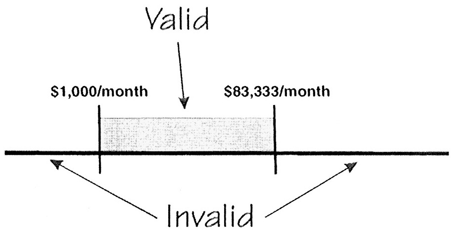
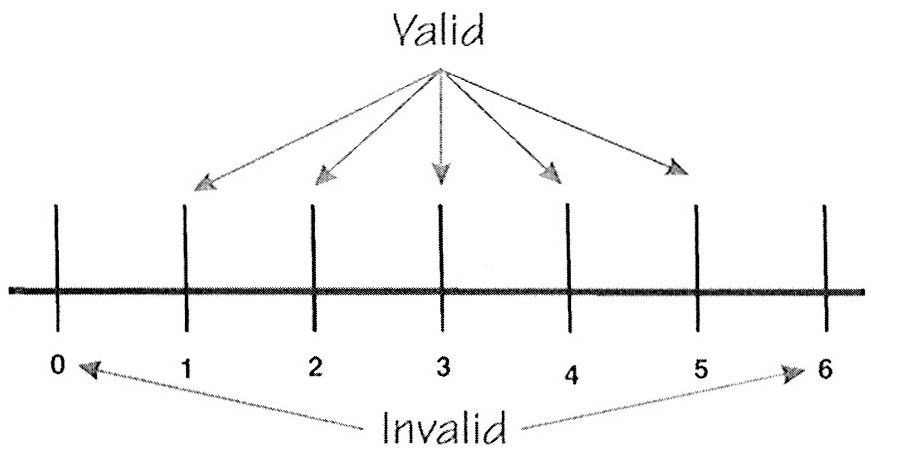
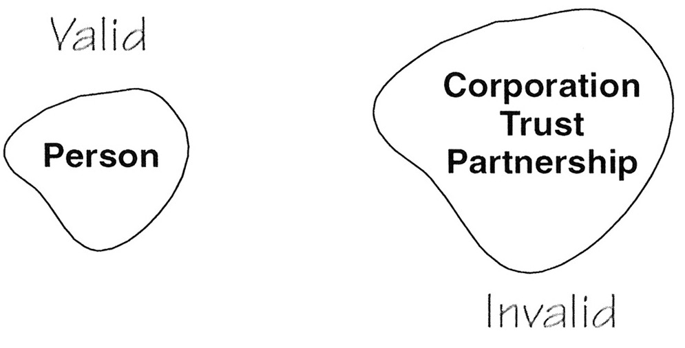
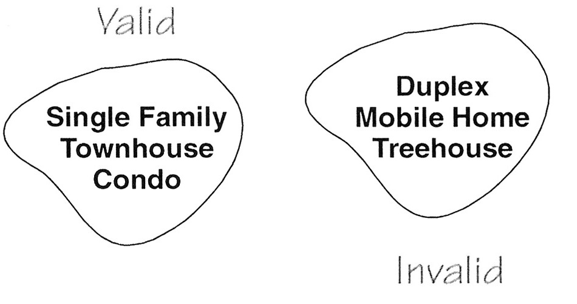

## 技术

等价类划分法使用步骤简单。第一步：划分等价类。第二步：为每个等价类创建一个测试用例。如果你有时间和精力你也可以为每一个等价类创建额外的测试用例。额外创建的用例也许会让你觉得更保险，但很少会发现第一个用例没有发现的缺陷。

&nbsp;&nbsp; **看点：** 有个叫 Judy 的学生，觉得每个等价类只有一个用例很不放心，她觉得至少应该有 2 个用例才保险。我表示如果她有时间和金钱，这种方法很好，但额外的测试可能无效。我让她记录一下额外的测试用例发现了问题而第一个用例没有发现的情况并告诉我，但是我没有再收到 Judy 的答复。

不同类型的输入需要不同类型的等价类，我们可以考虑下面这 4 种可能性。同时让我们假设一种防御性的测试理念，即测试有效和无效输入，测试无效输入通常是缺陷的重要来源。

如果输入的是连续值，那么可以分为 1 个有效等价类和 2 个无效等价类（小于，大于）。以 Goofy Mortgage Company 为例，他们编写一个抵押贷款的程序，给月薪 1,000 到 83,333 美元之间的人提供抵押贷款。小于 1,000 美元的没有资格，大于 83,333 美元的不需要贷款，付现金就可以了。
对于有效输入我们也许会选择 1,342 每月，对于无效值我们也许会选择 123 每月和 90,000每月。

    
     
    
Figure 3-1: 连续等价类

如果输入是不连续的范围，也是1个有效等价类和2个无效等价类（小于，大于），GMC会处理1到5套房子的情况（记住，这是很笨的做法），0或者更少的房子不是合法输入，6或者更大也不是，分数和小数更不是有效值，比如2 1/2 or 3.14159。

    
     
    
Figure 3-2: 离散等价类

对于有效输入我们选2个房子，无效选择-2和8.

GMC 只贷款给个人，他们不贷款给公司，信托机构，合伙企业，其他类型的合法组织。

    
     
    
Figure 3-3: 单选等价类

对于有效值我们选“person”，对于无效等价类我们选"corporation" 或 "trust" 或者其他随机文本。多少无效输入用例需要创建，至少一个，也许为了保证信心追加用例。

GMC会将公寓，市区住宅，独立别墅作为抵押物。不会将单位房，拖车住房，树房或者其他建筑物。

    
     
    
Figure 3-3: 多选等价类

对于有效输入我们选 "Condominium," "Townhouse," or "Single Family，因为规则里说到从一个等价类中选一个用例，更好的理解是要遍历有效输入的每个入口，也就是说当这个有效值足够小的时候。但是如果是有55个州需要选择呢？Columbia地区，美国的各个地区，要测试所有吗？世界上所有的国家呢？当前，正确答案是取决于组织风险，作为测试人员，我们漏测是不应该的。

现实中，我们很少为一个等价类中的一个输入构建一个测试，大部分情况下，我们同步进行其他输入的组合，比如，

&nbsp;&nbsp; **关键点：** 现实中，我们很少为一个等价类中的一个输入构建一个测试

表 3-1: 有效输入数据的测试用例

|月收入|住宅数量|申请人|住宅类型|结果|
|:---:|:---:|:---:|:---:|:---:|
|$5,000|2|个人|公寓|有效|

每个值都是有效输入，所以我们预期结果可以贷款。

对于无效输入采用类似方法

表 3-2: 无效输入数据的测试用例。这不是一个好方法。

|月收入|住宅数量|申请人|住宅类型|结果|
|:---:|:---:|:---:|:---:|:---:|
|$100|8|合伙关系|树屋|无效|

如果系统接受了这些值并认为可以贷款，那么系统对这些输入都没有校验。如果系统认为不能贷款，但是测试人员无法定位是哪个输入没有被系统接受。

比如：
**ERROR: 653X-2.7 INVALID INPUT**
在很多情况下，一个输入域的无效值会抵消或者掩盖另一个输入域的无效值，导致系统认为输入有效。更好的做法是一次测试一个无效输入，

表 3-3: 每次更改一个无效数据生成一组测试数据

|月收入|住宅数量|申请人|住宅类型|结果|
|:---:|:---:|:---:|:---:|:---:|
|**$100**|1|个人|单身家庭|无效|
|$1342|**0**|个人|公寓|无效|
|$1342|1|**公司**|单身家庭|无效|
|$1342|1|个人|**树屋**|无效|

为了增强信息，我们输入值可以考虑多样化。

表 3-4: 既改变无效数据也改变有效数据生成一组测试数据

|月收入|住宅数量|申请人|住宅类型|结果|
|:---:|:---:|:---:|:---:|:---:|
|**$100**|1|个人|单身家庭|无效|
|$1342|**0**|个人|公寓|无效|
|$1342|3|**公司**|联排别墅|无效|
|$1342|2|个人|**树屋**|无效|

另外一个使用等价类划分的方法是检查输出而不是输入，将输出值进行等价类划分，在确定哪些输入可以触发输出等价类。这个方法的优势是可以引导测试人员先检查，后测试，每个不同类型的输出都可以覆盖到。但是这个方法具有欺骗性，在前面的例子里，对于人力资源系统，其中一个输出时NO，不要雇佣。粗略的看，输入为这个等价类{0, 1, ..., 14, 15}，注意不是所有的输入集，{55, 56, ..., 98, 99} 作为输入也可以让系统输出NO，很显然要保证所有隐含的输出都覆盖很重要，同时要注意不能忽略重要输入。